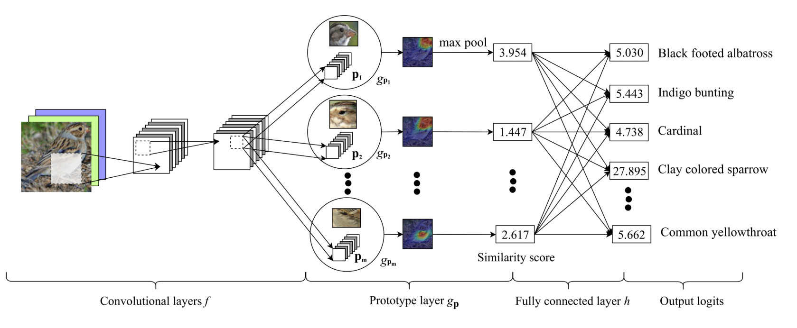

# This Looks Like That: Deep Learning for Interpretable Image Recognition

- Đang tự hiểu:
    - Process sẵn:
        - Dataset gồm ảnh các loài chim và label là tên loài.
        - 1 model classifier để phân loại chim.
        - Heat map để lấy những thành phần quan trọng nhất mà predict đúng tên loài -> tập các prototypes (tập A).
    - Cho 1 test image
    - Đưa qua 1 model part-based để chia thành các bộ phận.
    - Tìm similarity giữa từng bộ phận so khớp với các ảnh prototype trong tập A.
    - Tổng hợp similarity lại và đưa ra kết luận cuối.
    - Đang hiểu nó như voting : D

- Cần tìm hiểu:
    - Part-based model là gì, trong paper đang đề cập một số model:
        - Part R-CNN[53]: 76.4 (bb+anno.); PS-CNN [15]: 76.2 (bb+anno.);
        - PN-CNN [3]: 85.4 (bb+anno.); DeepLAC[24]: 80.3 (anno.);
        - SPDA-CNN[52]: 85.1 (bb+anno.); PA-CNN[19]: 82.8 (bb);
        - MG-CNN[46]: 83.0 (bb), 81.7 (full); ST-CNN[16]: 84.1 (full);
        - 2-level attn.[49]: 77.9 (full); FCAN[26]: 82.0 (full);
        - Neural const.[37]: 81.0 (full); MA-CNN[55]: 86.5 (full);
        - RA-CNN[7]: 85.3 (full)
        - Paper part-based:
            - Part-based R-CNNs for Fine-grained Category Detection.
            - Part-Stacked CNN for Fine-Grained Visual Categorization
            - Bird Species Categorization Using Pose Normalized Deep Convolutional Nets
            - Deep LAC: Deep Localization, Alignment and Classification for Finegrained Recognition.
            - SPDA-CNN: Unifying Semantic Part Detection and Abstraction for Fine-grained Recognition
            - Fine-Grained Recognition without Part Annotations.
            - ...
    - Làm sao để giải thích part-based model
    - Khái niệm part-based model theo gpt: Part-based model (mô hình dựa trên các phần) là một kỹ thuật trong học máy và thị giác máy tính, trong đó mô hình tập trung vào các phần quan trọng hoặc cục bộ của đối tượng để thực hiện dự đoán. Các mô hình này đặc biệt hữu ích trong các tác vụ như Fine-grained Image Recognition (nhận diện hình ảnh chi tiết) vì chúng giúp tập trung vào các đặc trưng nhỏ và tinh vi phân biệt các lớp tương tự nhau.

- Đọc thêm (Anh Đức đưa): PEEB: Part-based Image Classifiers with an Explainable and Editable Language Bottleneck

